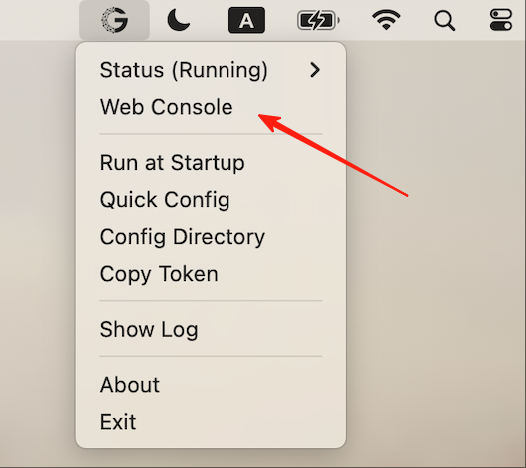
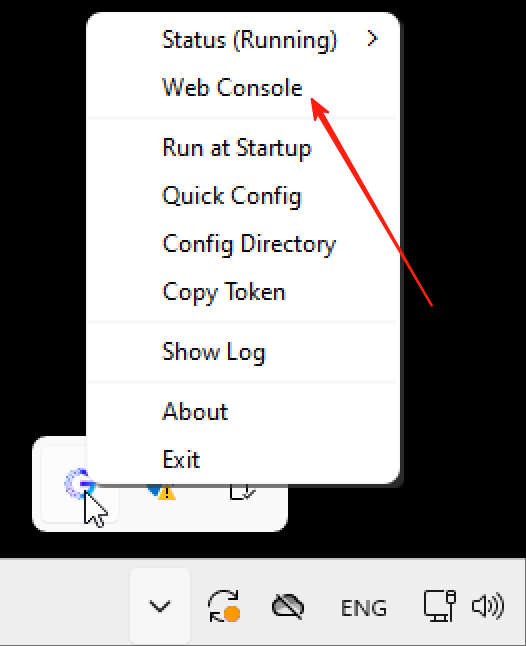
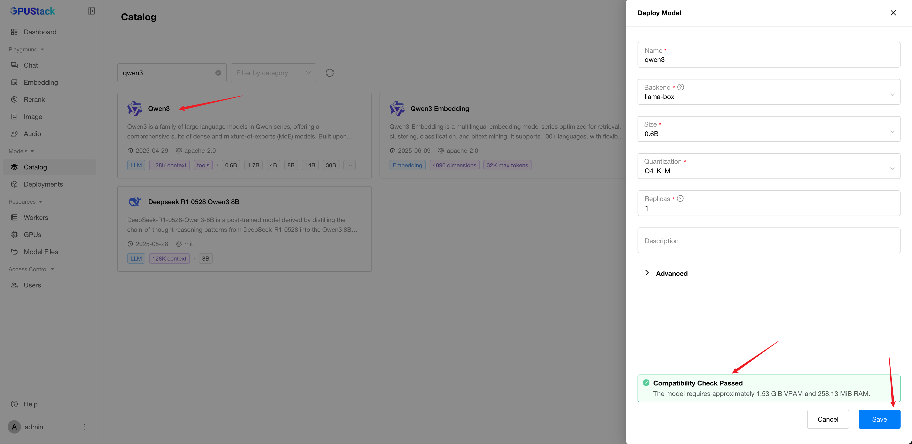

# Quickstart

## Install GPUStack

=== "Linux"

    If you are using NVIDIA GPUs, ensure [Docker](https://docs.docker.com/engine/install/) and [NVIDIA Container Toolkit](https://docs.nvidia.com/datacenter/cloud-native/container-toolkit/install-guide.html) are installed on your system. Then, run the following command to start the GPUStack server.

    ```bash
    docker run -d --name gpustack \
          --restart=unless-stopped \
          --gpus all \
          --network=host \
          --ipc=host \
          -v gpustack-data:/var/lib/gpustack \
          gpustack/gpustack
    ```

    For more details on the installation or other GPU hardware platforms, please refer to the [Installation Documentation](installation/installation-requirements.md).

    After the server starts, run the following command to get the default admin password:

    ```bash
    docker exec gpustack cat /var/lib/gpustack/initial_admin_password
    ```

    Open your browser and navigate to `http://your_host_ip` to access the GPUStack UI. Use the default username `admin` and the password you retrieved above to log in.

=== "macOS"

    Download the [installer](https://gpustack-installer-1303613262.cos.ap-guangzhou.myqcloud.com/releases/latest/gpustack.pkg) and run it to install GPUStack.

    !!! note

        **Supported platforms:** Apple Silicon (M series), macOS 14 or later

    After the installation is complete, the GPUStack icon will appear in the status bar. Click the GPUStack icon in the status bar and select `Web Console` to open the GPUStack UI in your browser.

    {width=30%}

=== "Windows"

    Download the [installer](https://gpustack-installer-1303613262.cos.ap-guangzhou.myqcloud.com/releases/latest/GPUStackInstaller.msi) and run it to install GPUStack.

    !!! note

        **Supported platforms:** Windows 10 and Windows 11

    After the installation is complete, the GPUStack icon will appear in the system tray. Click the GPUStack icon in the system tray and select `Web Console` to open the GPUStack UI in your browser.

    {width=30%}

## Deploy a Model

1. Navigate to the `Catalog` page in the GPUStack UI.

2. Select the `Qwen3` model from the list of available models.

3. After the deployment compatibility checks pass, click the `Save` button to deploy the model.



4. GPUStack will start downloading the model files and deploying the model. When the deployment status shows `Running`, the model has been deployed successfully.


5. Click `Playground - Chat` in the navigation menu, check that the model `qwen3` is selected from the top-right `Model` dropdown. Now you can chat with the model in the UI playground.


## Use the model via API

1. Hover over the user avatar and navigate to the `API Keys` page, then click the `New API Key` button.

2. Fill in the `Name` and click the `Save` button.

3. Copy the generated API key and save it somewhere safe. Please note that you can only see it once on creation.

4. You can now use the API key to access the OpenAI-compatible API endpoints provided by GPUStack. For example, use curl as the following:

```bash
# Replace `your_api_key` and `your_gpustack_server_url`
# with your actual API key and GPUStack server URL.
export GPUSTACK_API_KEY=your_api_key
curl http://your_gpustack_server_url/v1/chat/completions \
  -H "Content-Type: application/json" \
  -H "Authorization: Bearer $GPUSTACK_API_KEY" \
  -d '{
    "model": "qwen3",
    "messages": [
      {
        "role": "system",
        "content": "You are a helpful assistant."
      },
      {
        "role": "user",
        "content": "Tell me a joke."
      }
    ],
    "stream": true
  }'
```

## Cleanup

After you complete using the deployed model, you can go to the `Deployments` page in the GPUStack UI and delete the model to free up resources.
